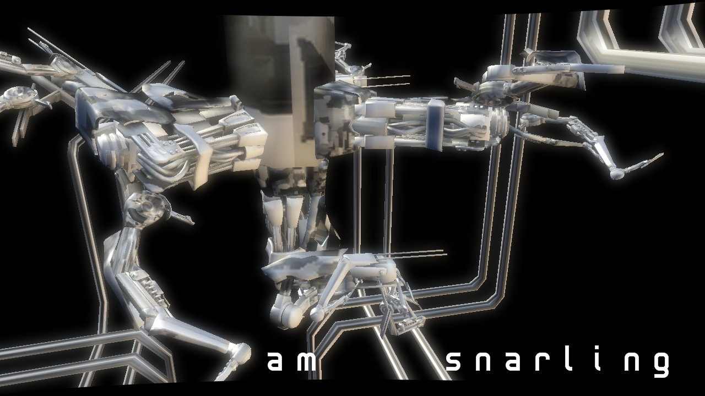
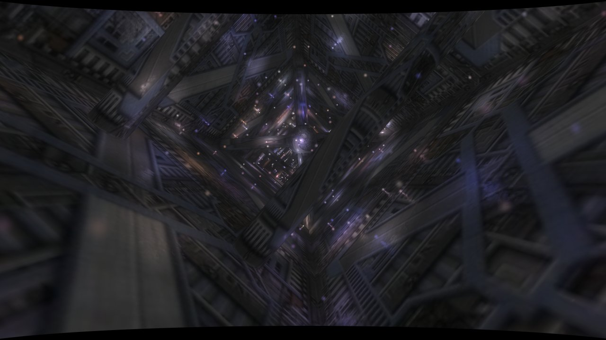
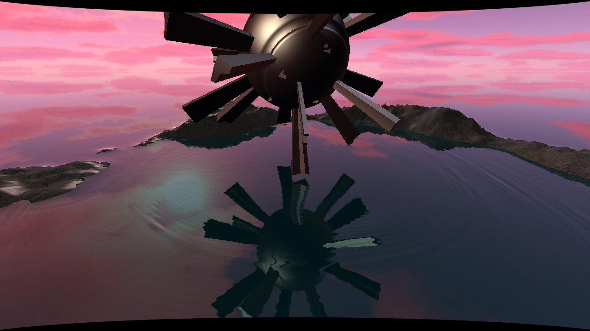
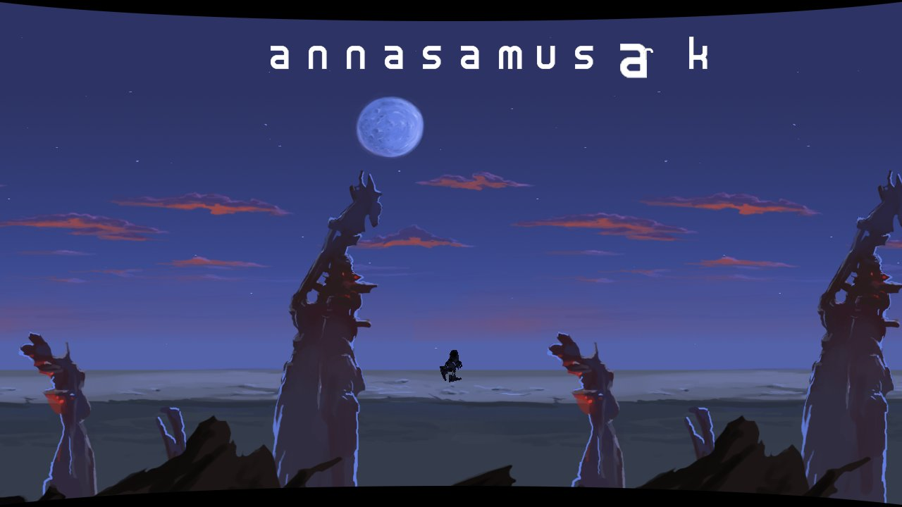
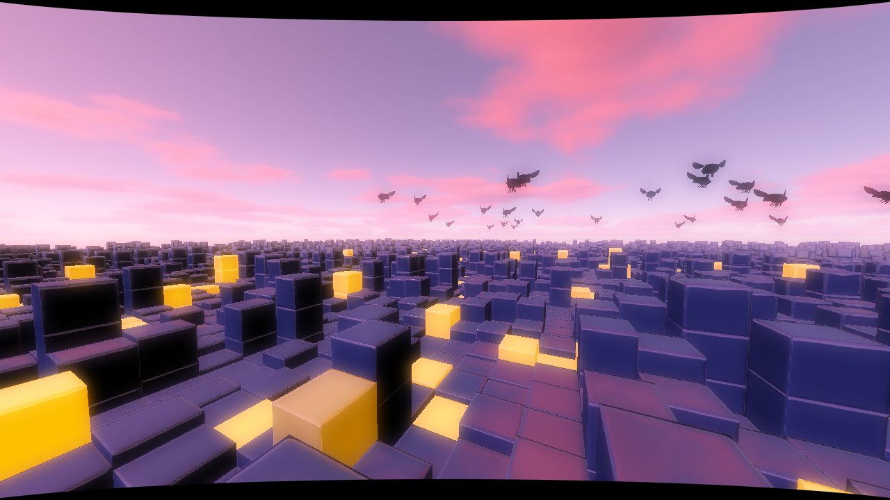
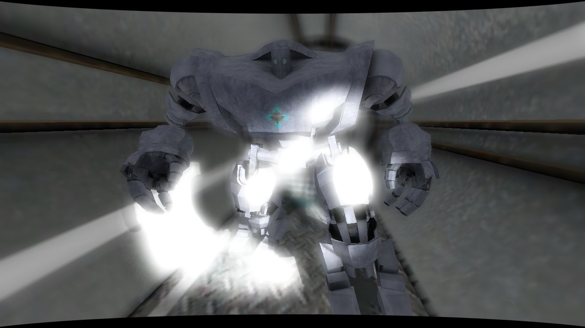
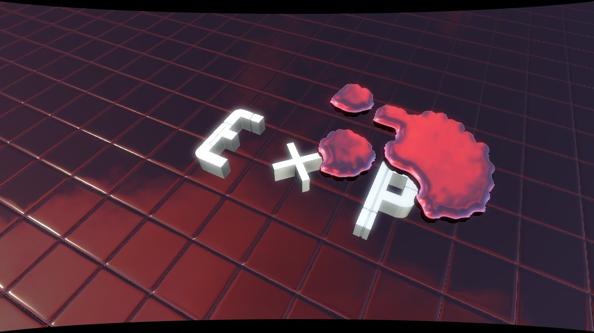
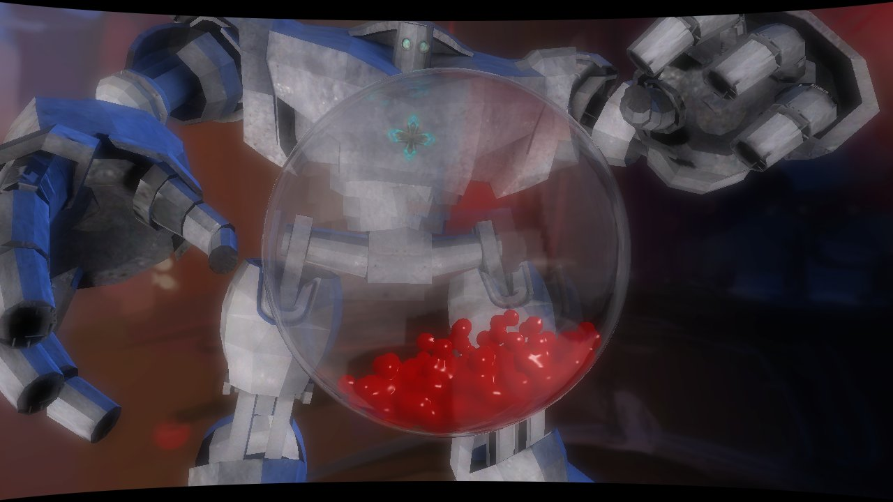
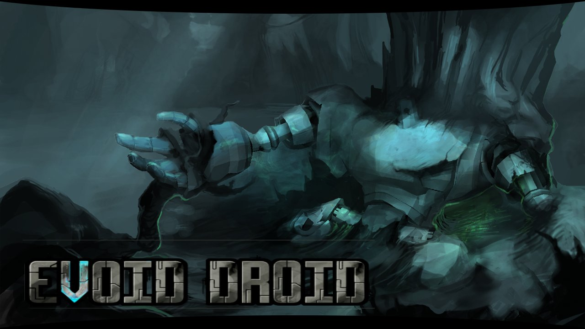

# Evoid Droid — WebGL

**▶ [Watch it in your browser](https://gmegidish.github.io/evoid-droid-webgl/)** · press **F** for fullscreen

*Evoid Droid* is a demo by [Excess](https://www.pouet.net/groups.php?which=1360) and [Portal Process](https://www.pouet.net/groups.php?which=3466). It took **4th place in the combined demo competition at Assembly 2007** [1]. It ran on an Xbox 360, as a game for Microsoft's XNA Creators Club.

That platform is gone. The Creators Club closed, and the demo only exists as a 25 MB `.ccgame` file. This repository takes that file apart and rebuilds the demo in a browser, with Three.js. Same timeline, same music, same random seeds.

| | |
|---|---|
|  |  |
|  |  |
|  |  |
|  |  |
|  |  |

## Controls

| Key | Action |
|---|---|
| Click | Start |
| **F** | Toggle fullscreen |
| Space | Pause / resume |
| ← / → | Seek 5 s |
| H | Show time |

Add `#t=42` to the URL to start at 42 s.

## Credits

- [gloom](https://www.pouet.net/user.php?who=1265): graphics, music
- [svok](https://www.pouet.net/user.php?who=998): code
- In-demo credits: graphics by am and snarling · music by gloom and flipside · code by kmk, krav and svok

All visuals, models and music belong to their authors. This repository only re-hosts them in formats a browser can read.

---

# How it was made, and how it was unmade

## A cabinet in disguise

The first four bytes of `evoid_droid_by_excess_process.ccgame` give it away.

```
00000000: 4d53 4346 0000 0000 38c6 8b01 ...    MSCF....8...
```

`MSCF` is a Microsoft Cabinet. The `.ccgame` extension is just a label. Any CAB tool opens it.

```
size        25,937,464 bytes
files       105
folders     15
blocks      279
compression MSZIP
```

Inside, the files have no names. They are called `0`, `1`, `2`, all the way to `103`. The 105th file is `XCabInfo.resources`, a serialized .NET resource set. It holds the real names, in order, plus a GUID, a version, a PNG thumbnail, the target platform (`xbox360`) and the entry point (`Demo360.exe`).

Apply the table and the package becomes a normal XNA game:

| Files | What |
|---|---|
| 0 | `Demo360.exe`, 167 KB of .NET code |
| 1 | `SkinnedModel.dll`, 20 KB |
| 2–4 | 3 fonts |
| 5–7 | music |
| 8–33 | 26 shaders |
| 34–41 | 8 models |
| 42–103 | 62 textures |

## The toolchain, 2007

Evoid Droid is written in **C#**. On the Xbox 360, XNA ran on the .NET Compact Framework. No C++, no assembly. A demo group shipped a 5-minute production in managed code.

The rest of the stack is visible in the files:

- **XNA Game Studio Express 1.0.** Every asset was compiled ahead of time into `.xnb` files for the Xbox.
- **HLSL effects**, compiled to Xbox 360 microcode. The binaries name `vs_3_0` / `ps_3_0` and compiler `2.0.4314.0`.
- **RenderMonkey**, probably. Parameter names like `fAmbient`, `fSpecularPower`, `fLightPosition` and `matViewProjection` are AMD RenderMonkey's template defaults.
- **3ds Max and FBX.** Texture folders end in `.fbm`. Textures are named `Box100CompleteMap` and `ChamferCyl02CompleteMap`, which is Max's render-to-texture naming. Every animation clip is called `Take 001`, the FBX default.
- **XACT** for audio.
- **Two Microsoft samples, used as-is.** The glow is the XNA *Bloom* sample, with its 7 presets. Character animation is the XNA *Skinned Model* sample: that is `SkinnedModel.dll`.

## One timeline to rule them all

The decompiled code is about 11,000 lines in 60 classes. The architecture fits in a paragraph.

Every visual is a `DemoEffect`. It can `init`, `render`, and react to events. A `Timeline` keeps a dictionary of effects and a sorted list of events. Each frame, it fires the events whose time has come, then asks **every** effect to render. Inactive ones return immediately.

An event is a time in milliseconds, an effect name, a command, and four floats:

```csharp
addEvent(42713L, "glow",  eType.GlowPreset, 1f);
addEvent(42713L, "flash", eType.InitAndBegin);
addEvent(42713L, "flash", eType.FlashDuration, 800f);
addEvent(42713L, "claws", eType.InitAndBegin);
addEvent(42713L, "claws", eType.SelectCamera, 1f);
```

The whole show is one method of about 300 such lines, written by hand. There are 35 commands, from `ShakeStart` to `BoidsBehaviour`.

Draw order is never stated anywhere. It is the order effects were inserted into the dictionary:

```
scroll  claws  tunnel  robot  beebox  waves  liquid  metal  splines
glow  wipe  endimg  edge  image  fade  change  text  flash  blackbars  stats
```

Scenes come first. Post-processing comes after: glow reads the back buffer the scene just drew, then the fades, the transitions, the text, and the letterbox on top.

Many events fall on a **4,064 ms grid**. That is one bar of the music. The strobe at 3:21 uses steps of 377 and 755 ms: a quarter and a half beat.

Three more files, `KimTimeline`, `KyrreTimeline` and `AreTimeline`, look like personal timelines, one per coder, for working on a scene alone.

## Four seeds

Some scenes use `System.Random` with a fixed seed. They look the same on every run.

| Seed | Generates |
|---|---|
| 1339 | the 5 intro splines and 5,000 stars |
| 1338 | 37 bee flight paths |
| 1337 | the credits letter scramble |
| 7 | 300 metal boids |

To get the same splines in a browser, JavaScript needs the same numbers. So the port reimplements .NET's generator: Knuth's subtractive method, 55-entry table, including .NET's odd `inextp = 21`. Seed 1339 now draws the same tubes in Chrome that it drew on an Xbox in 2007.

## Ten scenes

**0:00 Splines.** Five random walks of 400 unit steps, smoothed by a closed Catmull-Rom spline. Each becomes a tube with a 6-sided cross-section, 6,400 rings long. Rings are oriented by parallel transport, so tubes never twist. A per-vertex `T` and a uniform `fT` make them grow at 7 control points per second.

**0:42 Claws.** A 140-bone, 125-mesh machine lit by XNA's default three-light rig. Four spline cameras, a shake on every bar. 21 of its parts have no texture and still render with texturing on. On the Xbox, they inherit whatever texture was bound last.

**1:07 Tunnel.** Deferred shading in 2007, on a console, in C#. A G-buffer of position, bumped normal and colour. Then 640 light volumes, drawn additively. The lights are physical: gravity, damping, elasticity 0.5, collisions with spheres, planes and cylinders.

**1:38 Waves.** A 1024² height field running the wave equation on the GPU, across 3 render targets. How do objects push the water? With the stencil buffer. A top-down orthographic render counts front faces up and back faces down. What is left is the object's cross-section at the water line.

**2:32 Scroller.** Six parallax layers and a skinned robot on the horizon. It only ever plays the first second of its run cycle.

**3:04 Bee box.** A 150×150 field of bump-mapped cubes reflecting a sky cube map. 37 skinned bees. Variance shadow maps, 512², blurred three times.

**3:29 Robot.** A 59-bone robot runs down a 5-segment tunnel that repeats forever. Five cameras. A spotlight follows it with VSM shadows. A full-screen HDR chain does adaptive tone mapping and depth of field focused on the robot.

**3:54 Metal.** 300 boids avoid 12 capsules shaped like "E×P". Each boid is drawn as a sphere into depth and normal buffers. The normals are blurred four times, carefully, across depth. The spheres melt into one surface: screen-space fluid rendering, the technique games picked up years later.

**4:12 Liquid.** 400 particles of SPH fluid with the Poly6, Spiky and viscosity kernels. Rendered as screen-space fluid inside a glass ball. The ball reflects a cube map rendered from its own centre, every frame.

**4:48 End.** A layered painting with light rays and a blur focus pull.

## Frame rate is a hidden parameter

The simulations step once per rendered frame, not per second. That makes the frame rate part of the result.

The liquid scene advances its robot animation like this:

```csharp
float num = time - lastTime;   // ms since the last frame
num *= 0.05f;
new TimeSpan(0, 0, 0, 0, (int)num);
```

```
at 60 fps: 16.7 ms × 0.05 = 0.83 → (int) → 0 ms    robot frozen
at 30 fps: 33.3 ms × 0.05 = 1.67 → (int) → 1 ms    robot moves
```

The robot moves in the video. So these scenes ran at about 30 fps on the Xbox. The port steps them at a fixed 30 Hz. At 60 Hz, the metal boids moved twice as fast and wandered away from the letters.

## XNB, the Xbox flavour

Every asset is an XNB file:

```
"XNB" 'x'     magic + platform (x = Xbox 360)
01            format version (XNA 1.x)
00            flags (uncompressed)
u32           file size
readers       e.g. "Microsoft.Xna.Framework.Content.Texture2DReader, ..."
object        the asset
objects       shared resources
```

The trap is endianness. Values the content pipeline wrote (ints, floats, matrices) are little-endian. Data copied straight from the GPU's world (vertex buffers, index buffers, pixels, DXT blocks) is big-endian. The Xbox 360's PowerPC CPU and Xenos GPU are both big-endian.

Three details cost the most time:

- **DXT blocks** are made of 16-bit words. Swap every byte pair, add a DDS header, and any decoder reads them.
- **Bone indices** use `Byte4`, a packed 32-bit value. In big-endian, the first component lands in the last byte. Read naively, every vertex is skinned to the wrong bone.
- **XNA 1.x models** store vertex declarations once per model, and parts point to them by index. Later XNA versions moved them into the parts. Tools written for XNA 3 or 4 fail on these files.

Textures are linear, not tiled. I expected to have to undo Xenos memory tiling. I didn't.

## The music

`Wave Bank.xwb` holds one stream: 4:56.955 of stereo **XMA2** at 44,099 Hz, about 210 kbps. XMA2 is the Xbox's hardware audio codec. vgmstream [2] decodes it.

The code that plays it is about twenty lines. It fires the cue `"demotest"` and never looks at it again. There is no audio sync. Music and visuals start together and trust their clocks.

## The shaders are the hard part

Each effect file holds a parameter table, techniques, render states, and shader blobs. The blobs are Xbox 360 microcode for the Xenos GPU.

The parameter table survives intact, with default values. One trap: each parameter's default comes *before* its name. Read it the other way and every value shifts onto the wrong parameter.

```
Spline.xnb
  fSpecular       2.0  1.92  1.44
  fSpecularPower  256
  fLightPosition  -785  423  453
```

The blobs also keep their literal constants. The transition at 0:41 holds `0.5, -0.5, ±1, 1.1`. That pins it down as a zoom about the centre:

```glsl
vec2 src = 0.5 + (uv - 0.5) * (1.1 - fT);
```

The microcode itself is not disassembled yet. So the 26 shaders in this port are reconstructions: rewritten in GLSL from parameter names, defaults, literals, and how the C# uses them. Everything else is ported from the code. This is the part that is not.

## How the port works

1. Unpack the cabinet, rename the files from the manifest.
2. Decompile `Demo360.exe` and `SkinnedModel.dll` with ILSpy [3].
3. Convert the assets with the scripts in `tools/`:
   - `xnb_textures.py`: Color, DXT and cube textures → PNG
   - `xnb_models.py`: models and skeletal animation → JSON + binary
   - `xnb_fonts.py`: glyph metrics → JSON
   - music: vgmstream, then ffmpeg → MP3
4. Port the engine 1:1: `Timeline`, `DemoEffect`, every event. three.js render targets stand in for XNA's back buffer.
5. Port each scene from its C#, by hand.
6. Compare against a video of the original, and fix the differences.

Run it locally with any static server:

```bash
python3 -m http.server 8000
# open http://localhost:8000/
```

```
index.html   the demo page
src/         engine, timeline, effects/*
assets/      converted textures, models, fonts, audio
tools/       the XNB converters
docs/        screenshots
```

## Going further

- [1] [Evoid Droid on Pouët](https://www.pouet.net/prod.php?which=31587)
- [2] [vgmstream](https://github.com/vgmstream/vgmstream), which decodes XMA2
- [3] [ILSpy](https://github.com/icsharpcode/ILSpy), the .NET decompiler
- [4] [three.js](https://threejs.org)
- [5] [Xenia](https://github.com/xenia-project/xenia), an Xbox 360 emulator whose shader translator could disassemble the original shaders
